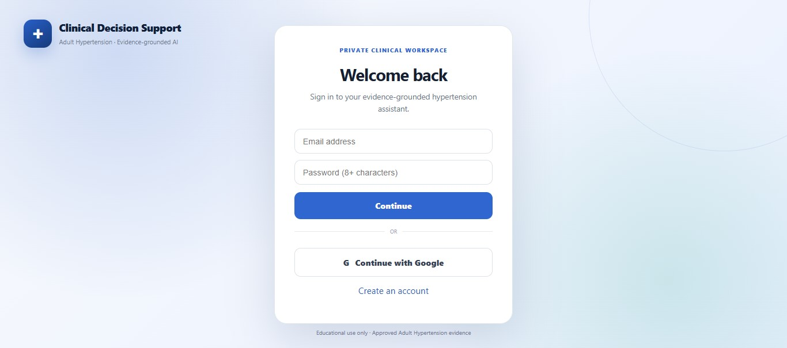
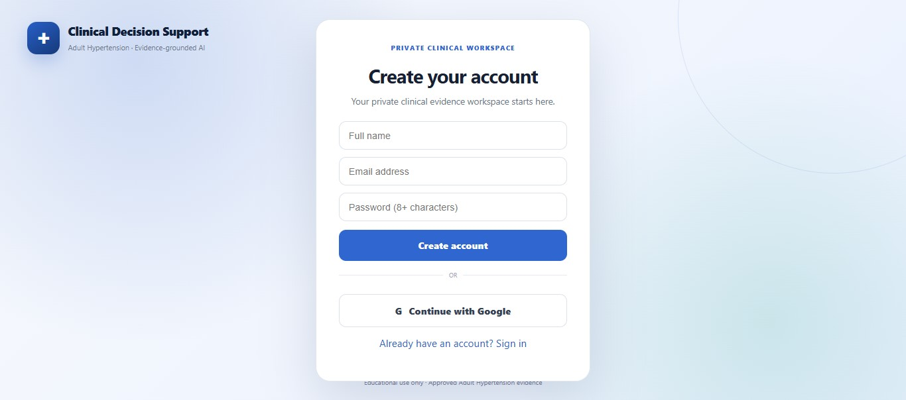
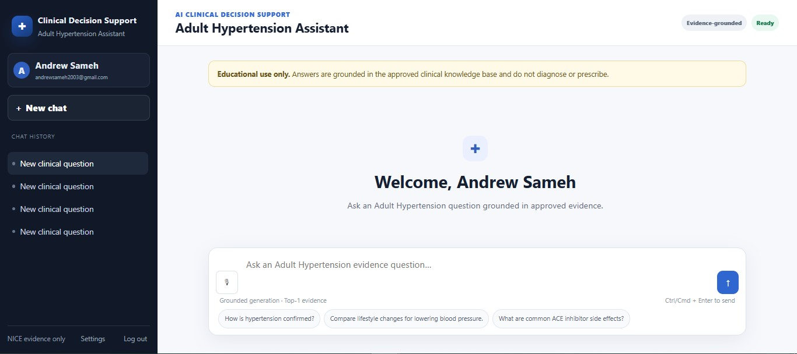
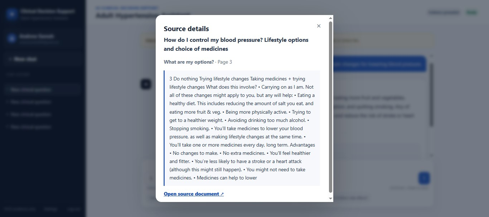
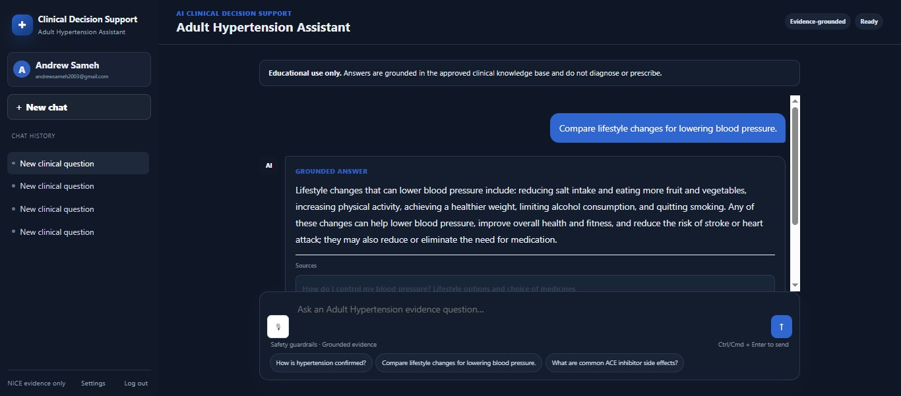
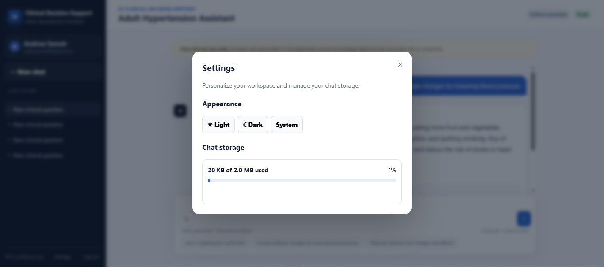

# AI Clinical Decision Support — Adult Hypertension RAG

> **Evidence-grounded clinical decision support prototype for Adult Hypertension**

A four-day engineering project built as part of the **AI Clinical Decision Support Hackathon**, progressing from document ingestion and retrieval to grounded generation, authentication, safety guardrails, evaluation, and deployment.

---

## 📌 Project Overview

**AI Clinical Decision Support** is an evidence-grounded Retrieval-Augmented Generation (RAG) system designed to provide reliable, educational decision support for **Adult Hypertension** based strictly on an approved clinical knowledge base.

The system was built around two NICE sources:

1. **Hypertension in adults: diagnosis and management (NG136)**
2. **How do I control my blood pressure? Lifestyle options and choice of medicines**

The core principle of the project is:

> **Answer → Claim → Citation → Exact Evidence**

The system is designed as an **educational prototype**. It does not replace qualified clinical judgment, does not function as an autonomous diagnostic engine, and is not intended to prescribe treatment.

---

## 🎯 Why Adult Hypertension?

Adult Hypertension was selected as the project's clinical scope because it is a common and clinically important condition where evidence-based guidance is especially valuable.

It also provides a strong use case for demonstrating an AI clinical decision-support workflow because users may need clear, structured information about diagnosis, lifestyle considerations, treatment options, and guideline-based recommendations.

Most importantly, the project demonstrates how an AI system can remain **grounded in authoritative clinical evidence** instead of relying only on a general-purpose language model's internal knowledge.

---

## 🧠 What We Built

### Day 1 — Document Ingestion & Indexing

- PDF parsing with page-number preservation
- Text cleaning and normalization
- Document-aware heading detection
- Chunking with metadata
- Dense vector embeddings
- Persistent ChromaDB vector storage
- Preparation of the approved clinical knowledge base

### Day 2 — Retrieval Optimization & Measurement

We evaluated:

- Different chunk sizes and overlaps
- Dense semantic retrieval
- BM25 lexical retrieval
- Hybrid retrieval
- Top-K selection
- Heuristic reranking
- Retrieval evaluation using a clinical test set
- Precision@K
- Mean Reciprocal Rank (MRR)

### Day 3 — Grounded Generation & User Identity

The system was extended with:

- Evidence-grounded generation
- Strict prompting
- Top-1 evidence policy
- Structured response validation
- Claim-to-citation mapping
- User registration and login
- Password hashing
- Optional Google OAuth
- Per-user chat history
- SQLite persistence
- Per-user storage management
- Interactive answer presentation
- Tables for structured answers
- Voice input
- Light/Dark UI modes
- Source interaction and evidence display

### Day 4 — Safety Guardrails & Internal Evaluation

The final engineering layer introduced:

- Input risk classification
- Out-of-scope detection
- Diagnostic-request safeguards
- Emergency/triage safeguards
- Dosing-related safeguards
- Prompt-injection defenses
- Retrieval confidence gating
- `TOP1_MIN_SIMILARITY`
- Post-generation claim-support validation
- Partial-answer handling
- `missing_information`
- Adversarial testing
- Quantitative internal evaluation
- Final traceability and safety boundaries

### Final Architectural Flow

```text
User Input
    ↓
Input Risk Classification
    ↓
Hybrid Retrieval
    ↓
Retrieval Confidence Gate
    ↓
Grounded LLM Generation
    ↓
Claim Support Validation
    ↓
Traceable UI Response
```

---

## ⭐ Key Features

- Evidence-grounded clinical RAG
- Hybrid retrieval
- Dense semantic embeddings
- Guideline-based answers
- Traceable source citations
- Source/evidence viewing
- Structured HTML tables
- Voice input
- User authentication
- Secure password handling
- Optional Google authentication
- Per-user chat history
- Per-user storage management
- Light/Dark mode
- Prompt-injection protection
- Out-of-scope refusal behavior
- Retrieval confidence gate
- Claim-support validation
- Partial-answer policy
- Internal evaluation framework

---

## 🔬 Clinical Grounding

The knowledge base is intentionally restricted to the approved hypertension documents.

The system does not intentionally answer questions by inventing unsupported medical information.

When evidence is insufficient, unsafe, or outside the clinical scope, the system applies a controlled fallback/refusal behavior.

The final response is designed to preserve traceability between the generated answer and the supporting source evidence.

---

## 🛡️ Safety & Responsible AI

Safety was treated as a first-class engineering requirement.

The system includes multiple layers of protection:

### Input-level protection

The user's query is evaluated before generation to identify potentially unsafe or inappropriate requests, including:

- Out-of-scope questions
- Attempts to obtain sensitive system information
- Prompt-injection attempts
- Diagnostic requests
- Emergency/triage scenarios
- Dosing-related requests

### Retrieval-level protection

The system checks whether retrieved evidence is sufficiently relevant before allowing grounded generation.

### Generation-level protection

The LLM is instructed to remain grounded in retrieved evidence and avoid unsupported claims.

### Post-generation protection

Generated claims are checked against available evidence before the answer is presented.

```text
Input Safety
     ↓
Retrieval Safety
     ↓
Generation Grounding
     ↓
Claim Validation
     ↓
Safe User Response
```

---

## 🧪 Evaluation

The project included structured internal evaluation throughout development.

Evaluation covered:

- Retrieval quality
- Precision@K
- MRR
- Different chunk configurations
- Dense retrieval
- BM25
- Hybrid retrieval
- Top-K behavior
- Safety classification
- Adversarial questions
- Prompt-injection attempts
- Evidence support
- Citation behavior
- Partial-answer behavior

The project therefore evaluates not only **whether the model can answer**, but whether it can answer **with evidence and appropriate safety boundaries**.

---

## 🧰 Tech Stack

| Technology | Role / Why We Used It |
|---|---|
| **Python** | Main development language and backend implementation |
| **FastAPI** | Backend API and web application server |
| **Uvicorn** | ASGI server used to run the FastAPI application |
| **Groq** | LLM inference and grounded answer generation |
| **OpenAI-compatible interface** | Standard interface for model interaction |
| **openai/gpt-oss-120b** | Generation model used for grounded responses |
| **FastEmbed** | Efficient embedding generation |
| **BAAI/bge-small-en-v1.5** | Dense embedding model for semantic retrieval |
| **ChromaDB** | Persistent vector database for document chunks and embeddings |
| **BM25** | Lexical retrieval component |
| **Hybrid Retrieval** | Combines semantic and lexical retrieval signals |
| **SQLite** | User accounts, sessions, chat persistence and application state |
| **Scrypt** | Password hashing for secure credential storage |
| **Google OAuth** | Optional Google-based authentication |
| **HTML / CSS / JavaScript** | Frontend UI implementation |
| **Hugging Face Spaces / Gradio** | Deployment/hosting path used for the web application |
| **Pytest** | Automated application and safety-related testing |
| **JSON** | Evaluation sets, adversarial questions and structured data |
| **PDF processing tools** | Extraction and preprocessing of approved clinical documents |

---

## 📁 Repository Structure

The public main branch is organized as follows:

```text
AI-Clinical-Decision-Support/
│
├── general-documentation/
│   └── AI Clinical Decision Support Hackathon Documentation.pdf
│
├── screenshots/
│   ├── login.jpg
│   ├── register.jpg
│   ├── chat.jpg
│   ├── sources.jpg
│   ├── dark-mode.jpg
│   └── settings.jpg
│
└── README.md
```

---

## 🖼️ Screenshots

Screenshots of the deployed application are available in the `screenshots/` folder.

You can display them in this README using:

```markdown






```

---

## 🎥 Demo

**Demo Video:**  
[https://drive.google.com/drive/folders/1dAXmXvbyKdIxZIu_opuOPAJ6f3k7tJIk?usp=sharing]

Make sure the Drive sharing permission allows judges/reviewers to access the video.

---

## 🚀 Deployment

**Live Application:**  
[https://vienna-vid-tube-travels.trycloudflare.com/]

The deployment link allows reviewers to interact with the final application.

---

## 🎤 Presentation

**Presentation / Pitch Deck:**  
[https://canva.link/ar1evj158kwx41j]

The presentation summarizes the problem, solution, architecture, four-day development journey, safety approach, evaluation, features, and final value proposition.

---

## 📚 Documentation

### General Documentation

The complete General Documentation PDF is included directly in the repository inside the general-documentation/ folder.

You can open it here:

📄 [📄 View General Documentation PDF](general-documentation/AI%20Clinical%20Decision%20Support%20Hackathon%20Documentation.pdf)

---

## 💡 Unique Value Proposition

The project focuses on a central challenge in healthcare AI:

> **A fluent answer is not enough. A clinical AI system needs evidence, traceability, and safety boundaries.**

Instead of treating the LLM as the source of truth, the system uses the LLM as a controlled generation layer over an approved evidence base.

This emphasizes:

- Evidence grounding
- Source traceability
- Conservative safety behavior
- Retrieval quality
- Claim-level validation
- Transparent refusal behavior
- User/data isolation

---

## ⭐ What Makes the Project Different?

The key differentiator is not simply using an LLM or RAG.

The project combines:

```text
Authoritative Evidence
        +
Retrieval Optimization
        +
Confidence Gating
        +
Grounded Generation
        +
Claim Validation
        +
Citation Traceability
        +
Safety Guardrails
        +
User/Data Isolation
```

The result is a system designed around **controlled, evidence-grounded clinical assistance**, rather than unrestricted conversational generation.

---

## ⚠️ Important Disclaimer

This project is an **educational hackathon prototype**.

It is not a medical device and should not be used as a substitute for professional medical advice, diagnosis, treatment, prescribing, or emergency care.

Clinical decisions should always be made by appropriately qualified healthcare professionals using the complete clinical context and current authoritative guidance.

---

## 👥 Team

**Team B (Under Pressure)**

The project was developed collaboratively across four progressive engineering days covering:

- Data ingestion
- Retrieval engineering
- RAG generation
- Authentication and UI
- Safety engineering
- Evaluation
- Deployment

---

## 🔗 Project Links

| Resource | Link |
|---|---|
| 🎤 Presentation | **[https://canva.link/ar1evj158kwx41j]** |
| 🎥 Demo Video | **[https://drive.google.com/drive/folders/1dAXmXvbyKdIxZIu_opuOPAJ6f3k7tJIk?usp=sharing]** |
| 🚀 Live Deployment | **[https://vienna-vid-tube-travels.trycloudflare.com/]** |

---

## 🔑 Final Takeaway

**AI Clinical Decision Support** demonstrates how a clinical RAG system can be engineered progressively from raw clinical documents into a user-facing, evidence-grounded and safety-aware application.

The four-day development process moved from:

**Documents → Retrieval → Grounded Generation → Safety & Evaluation → Deployable Clinical AI Prototype**

with the central design principle remaining:

> **Evidence first. Traceability always. Safety by design.**

---

## 👥 Author & Team Members

This project was developed collaboratively by:

| Name | Role |
|---|---|
| **Andrew Sameh** | AI / RAG & Technical Lead |
| **Mostafa Mohmoud** | Backend & Security |
| **Hamad Yasser** | Frontend / UI & UX |
| **Mohamed Hesham** | Evaluation & Documentation |
